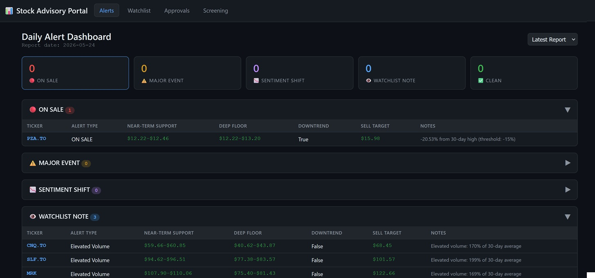
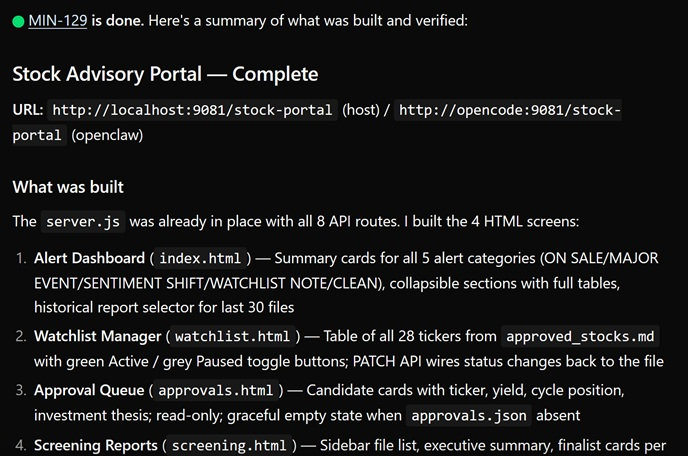

# agentyard

A self-hosted AI agent orchestration stack that pairs [Paperclip](https://github.com/paperclipai/paperclip) with sandboxed [openclaw](https://github.com/openclawai/openclaw) and [opencode](https://github.com/sst/opencode) agents running in Docker.

The stack keeps agents fully isolated from the host while giving them the internet access, tool skills, and file exchange they need to do real work. The included configuration uses a simulated **investment advisory scenario** as a real-world-ish test case — not as a production system, but as a concrete domain complex enough to exercise the full agent collaboration pattern.

---

## What it does

```
┌─ Host ─────────────────────────────────────────┐
│  Paperclip (orchestrator)  ←→  Browser UI      │
│         ↕ HTTP / SSH                           │
│  ┌── Docker ──────────────────────────────┐    │
│  │  openclaw  ←→  Anthropic               │    │
│  │  opencode  ←→  Anthropic               │    │
│  │  shared /exchange volume               │    │
│  └────────────────────────────────────────┘    │
└────────────────────────────────────────────────┘
```

- **Paperclip** runs on the host as the orchestration layer — manages agents, assigns goals, tracks costs, governs actions.
- **openclaw** is an HTTP agent gateway in Docker. Uses Anthropic Claude Haiku as the default model. Ships with built-in Brave web search. Custom skills extend it without modifying the image.
- **opencode** is a Bun-based coding agent in Docker, accessible over SSH. Builds and runs code, produces files, generates custom reports and UIs.

Both containers run with full internal permissions (root, all Linux capabilities except `SYS_ADMIN`) but **zero host access** — no host PID namespace, no Docker socket, no host filesystem beyond a single scoped exchange directory.

---

## Use cases

The stack is designed around **role-separated agents** — each agent has a distinct responsibility, and agents collaborate through a shared file exchange. The included example wires up a simulated investment advisory scenario as a test case (not a real advisory system) to demonstrate the pattern concretely:

- **Domain agents** (hosted in openclaw) handle research, analysis, and monitoring — Stock Watch Analyst, Financial Research Analyst, and similar roles. They produce reports and signals as files.
- **The dev agent** (opencode) is a full-stack developer that builds and runs custom web pages and APIs on demand, directly accessible in the browser at `http://localhost:9081`. Any agent or orchestrator can request it to build a UI or API endpoint — the result is live immediately, with no deployment step.
- **Paperclip** (the orchestrator) assigns goals, routes work between agents, and tracks task status.

| Capability | How it works |
|---|---|
| Live stock quotes & OHLCV data | Yahoo Finance skill (curl/node, no API key needed) |
| Web research & news | Brave Search built-in plugin (auto-enabled via `BRAVE_API_KEY`) |
| Financial analysis & reports | openclaw domain agents reason over data; daily alerts and monthly screens written to `/exchange/outbox/` |
| Custom UI dashboards & APIs | opencode dev agent builds and serves pages/APIs on request, browser-accessible at port 9081 |
| Cross-agent data flow | All agents share `/exchange` — domain agents write reports, dev agent reads them into UIs |

### Test setup — Stock Advisory Portal

The stack was run end-to-end to validate the multi-agent collaboration pattern. The file [docs/examples/paperclip-task-advisory-system-setup.md](docs/examples/paperclip-task-advisory-system-setup.md) contains the exact issue body submitted to Paperclip — portal build spec, routine schedules, file format contracts, and completion criteria. The CEO agent received it as a task and orchestrated the rest from there. Four agents played distinct roles:

| Agent | Platform | Role |
|---|---|---|
| CEO | Paperclip | Orchestrator — assigns goals, delegates tasks |
| Stock Watch Analyst | openclaw | Daily market monitoring; flags stocks on sale or sentiment shifts |
| Financial Research Analyst | openclaw | Deep-dive research; produces weekly screening reports |
| Full Stack Developer | opencode | Builds and serves browser-accessible pages and APIs on demand |

The CEO agent tasked the Full Stack Developer with building a portal to surface the analyst agents' output. The dev agent autonomously built and deployed a 4-screen **Stock Advisory Portal** at `http://localhost:9081/stock-portal`:

- **Alert Dashboard** — reads latest `daily-alert-*.md` report from openclaw outbox; category counts and collapsible tables
- **Watchlist Manager** — reads `approved_stocks.md`; view and toggle Active/Paused monitoring status per ticker
- **Approval Queue** — read-only view of pending board approval requests from Paperclip
- **Screening Reports** — monthly fundamental screens with finalist cards and sortable scoring table (`monthly-screen-*.md`)

The portal is served by `server.js` (Node.js built-ins only, no npm) with 9 API routes, registered as `stock-portal` in `serve-process.json`. The Paperclip task (MIN-9) closed automatically once the agent verified the portal was accessible and posted the URL as a comment.




---

## Architecture

| Component | Role | Access |
|---|---|---|
| Paperclip | Orchestrator, UI, cost tracking | Host — `http://localhost:3100` |
| openclaw | Agent gateway, research, analysis | Docker — `http://localhost:18789` |
| opencode | Coding agent, report/UI builder | Docker — SSH `ssh opencode`, UI `http://localhost:9081` |

**Model provider:** Anthropic (Claude Haiku 4.5 by default). No local LLM required.

---

## Prerequisites

- Docker Desktop for Windows
- Node.js 20+ and pnpm 9.15+
- API keys: Anthropic, Brave Search (free tier)

### Required repos

All four repos must exist as **sibling directories** under a common parent. `docker-compose.yml` and Paperclip launch commands reference them as `../openclaw`, `../opencode`, and `../paperclip`.

```
parent-dir/
├── agentyard/   ← git clone https://github.com/cibis/agentyard
├── openclaw/    ← git clone https://github.com/cibis/openclaw
├── opencode/    ← git clone https://github.com/cibis/opencode
└── paperclip/   ← git clone https://github.com/cibis/paperclip
```

```powershell
# From the parent directory that will contain all repos
git clone https://github.com/cibis/agentyard
git clone https://github.com/cibis/openclaw
git clone https://github.com/cibis/opencode    # default branch: dev
git clone https://github.com/cibis/paperclip
```

All three sibling repos are forks with agentyard-specific patches on top of their upstream default branch:

| Fork | Upstream | Patches on branch |
|---|---|---|
| [cibis/openclaw](https://github.com/cibis/openclaw) | [openclaw/openclaw](https://github.com/openclaw/openclaw) | `main` |
| [cibis/opencode](https://github.com/cibis/opencode) | [anomalyco/opencode](https://github.com/anomalyco/opencode) | `dev` |
| [cibis/paperclip](https://github.com/cibis/paperclip) | [paperclipai/paperclip](https://github.com/paperclipai/paperclip) | `master` |

To pick up a future upstream release for any fork, fetch from `upstream` and rebase:
```powershell
# openclaw (main) / opencode (dev)
git fetch upstream && git rebase upstream/main   # or upstream/dev for opencode

# paperclip
git fetch upstream && git rebase upstream/master
```

---

## Quick start

```powershell
# 1. Copy and fill in secrets
cp .env.example .env   # edit with your API keys

# 2. Build and start the agent containers
docker compose up -d --build

# 3. Verify both containers are healthy
docker compose ps

# 4. Generate the SSH key for opencode (one-time, no passphrase)
#    The public key in docker-compose.yml must match — see Architecture Decisions below
ssh-keygen -t ed25519 -C "opencode-key" -f "$env:USERPROFILE\.ssh\id_opencode" -N '""'
# Copy the public key output to the printf line in docker-compose.yml (opencode command block)
# Then add to ~/.ssh/config:
#   Host opencode
#       HostName localhost
#       Port 2223
#       User root
#       IdentityFile ~/.ssh/id_opencode
#       StrictHostKeyChecking no

# 5. Start Paperclip on the host
cd ..\paperclip && pnpm install && pnpm dev
```

Then open **http://localhost:3100** and register the agents:
- openclaw → `http://localhost:18789`, token from `OPENCLAW_GATEWAY_TOKEN` in `.env`
- opencode → SSH command `ssh opencode`

---

## Project layout

```
agentyard/
├── docker-compose.yml        # Container definitions (relative paths — portable)
├── .env                      # Secrets (never commit this)
├── config/
│   ├── openclaw.json         # openclaw gateway + model config
│   ├── opencode.jsonc        # opencode provider config
│   └── openclaw-workspace/
│       └── AGENTS.md         # Base workspace instructions for all openclaw agents
├── skills/
│   ├── yahoo-finance/SKILL.md      # Yahoo Finance skill (openclaw)
│   ├── opencode/SKILL.md           # Serve conventions (mounted into opencode)
│   ├── conventions/SKILL.md        # Path conventions (mounted into opencode)
│   └── file-exchange/SKILL.md      # File exchange rules (openclaw + opencode)
├── shared/                   # Bind-mounted into both containers at /exchange
│   ├── inbox/openclaw/
│   │   ├── approved_stocks.md      # Active watchlist (human-editable)
│   │   └── screening_criteria.md   # Screening filters (human-editable)
│   ├── outbox/               # Agents write results here
│   ├── scratch/              # Ephemeral working files
│   └── workspace/
│       ├── openclaw/
│       │   ├── stock-watch-analyst/AGENTS.md
│       │   └── financial-research-analyst/AGENTS.md
│       └── opencode/
│           └── AGENTS.md           # FullStack Dev domain context
└── docs/
    ├── ops-reference.md      # Stack debugging and ops reference
    ├── setup.md              # Full setup guide
    ├── interfaces.md         # API and interface reference
    └── examples/
        └── paperclip-task-advisory-system-setup.md  # Advisory system task template
```

---

## Adding skills to openclaw

Drop a `SKILL.md` file under `skills/<name>/SKILL.md` — no restart needed. The skill is live-mounted at `/app/skills/agentyard/` inside the container and scanned on every request.

See [skills/yahoo-finance/SKILL.md](skills/yahoo-finance/SKILL.md) for a working example.

---

## Architecture decisions

### openclaw version pin
`../openclaw` is pinned to commit `2949171fcc` (v2026.5.3, protocol v3) because Paperclip's openclaw-gateway adapter hardcodes protocol v3. Upgrading openclaw past v2026.5.4 breaks all agent connections until the Paperclip adapter is updated to match. Check `../paperclip/packages/adapters/openclaw-gateway/src/server/execute.ts` (`PROTOCOL_VERSION`) vs `../openclaw/src/gateway/protocol/version.ts` (`MIN_CLIENT_PROTOCOL_VERSION`) before upgrading.

### opencode SSH authorized_keys
The SSH public key for opencode is baked into the startup command in `docker-compose.yml`. It is written using `printf` on every container boot, so `--force-recreate` does not break SSH access. If you regenerate `~/.ssh/id_opencode`, update the `printf` line in the opencode `command` block and rebuild/recreate the container. Never use `echo` or PowerShell piping to write SSH keys — BOM characters break key parsing.

---

## Ports

| Port | Service | Purpose |
|---|---|---|
| `18789` | openclaw | Gateway API + Control UI |
| `9080` | openclaw | Web preview (container port 8080) |
| `2223` | opencode | SSH terminal |
| `9081` | opencode | Web UI + preview |
| `3100` | paperclip (host) | Board UI + REST API |

---

## Security model

Agents have **full permissions inside their container** and **zero access outside it**:

- Root user, all Linux capabilities except `SYS_ADMIN`
- Seccomp and AppArmor unconfined (agents need to run arbitrary code)
- No host PID/IPC namespace, no Docker socket, no `/var/run/docker.sock`
- Only one host directory is exposed: `./shared` → `/exchange` (scoped file exchange)
- Outbound internet via Docker bridge NAT (required for Anthropic API)

---

## Roadmap

- **Custom agents in Paperclip** — first-party agents built and registered directly in Paperclip, alongside the existing openclaw/opencode setup.
- **LangGraph.js-powered agents** — new agents implemented with [LangGraph.js](https://github.com/langchain-ai/langgraphjs) for structured, graph-based agentic workflows with explicit state machines and controlled execution flow, replacing ad-hoc prompt chaining.

---

## Documentation

- [docs/ops-reference.md](docs/ops-reference.md) — stack debugging and ops reference (Paperclip API, DB, containers)
- [docs/setup.md](docs/setup.md) — step-by-step setup from scratch
- [docs/interfaces.md](docs/interfaces.md) — API reference for all components
- [docs/examples/](docs/examples/) — reusable Paperclip task templates
